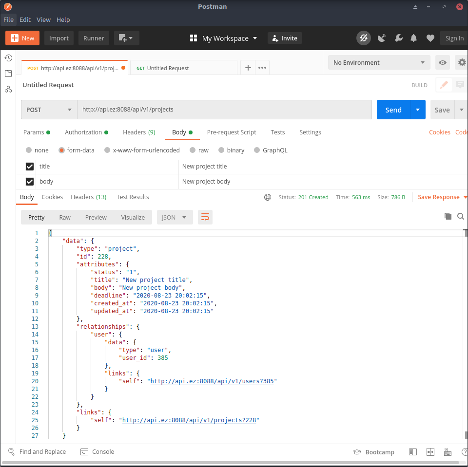
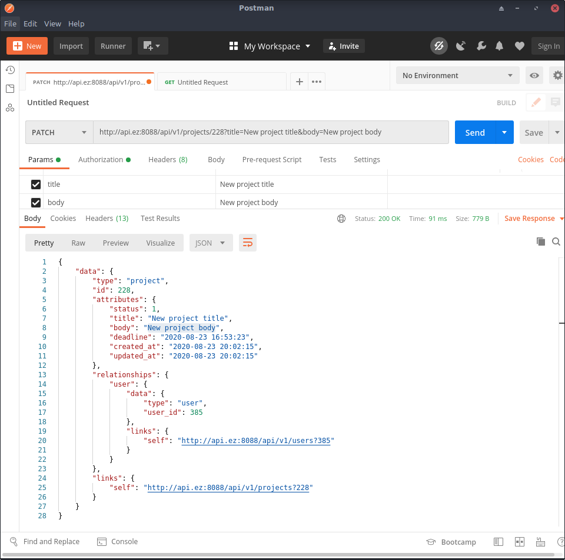

# Laravel MyTaskManager
### Техническое задание
**Описание задачи:**

Реализовать микросервисное приложение трекера задач с управлением задачами через JSON API. Можно использовать любой из современных фреймворков.

**Приложение должно содержать:**
1) Задачи
2) Список пользователей

**Возможные действия через API:**
1) Создание/удаление/редактирование задачи
2) Создание/удаление/редактирование пользователя
3) Поиск задач по фильтру с постраничной навигацией

**Технические требования**
- Приложение должно быть написано на PHP 7 или выше
- API должно быть написано по спецификации https://jsonapi.org/
- Весь код должен быть прокомментирован в стиле PHPDocumentor'a.
- Использовать любую реляционную БД (MySQL, PostgreSQL)
- Результат задания должен быть выложен на github и должна быть инструкция по запуску проекта. Также необходимо пояснить, сколько на каждую часть проекта ушло времени
- Никакого фронта не должно быть. Приложение должно работать только через JSON API.

**Плюсом будут:**
- Использование фреймворка Symfony или Laravel
- Соответствие стиля кода PSR-12
- Покрытие кода unit, функциональными и интеграционными тестами
- Работа с БД через миграции
- Использование ElasticSearch
- Использовать docker-compose для сборки приложения


### Планирование проекта

| № п./п. | Задачи  | Время выполнения (мин.)|
| ------------- | ------------- | ------------- |
| 1 | Планирование проекта (задачи проекта, структура таблиц)  | 30 |
| 2 | Подготовка рабочей среды (конфигурация apache, создание бд, создание проекта, настройка id)  | 25 |
| 3 | Создание репозитория, экспорт на github   | 5 |
| 4 | Создание миграций, фабрик, сидеров | 15 |
| 5 | Авторизация (регистрация пользователя, получение токена) | 240 |
| 6 | Списки задач (проекты) (создание, изменение, редактирование) | 300 |
| 7 | Задачи (создание, изменение, редактирование)
| 8 | Отношения (пользователи, проекты, задачи)
| 9 | Фильрация и вывод
| 10 | Поиск и ElasticSearch (индексация/поиск/удаление)
| 11 | Описание проекта в Readme


## Installation
#### 1. Git Clone
```sh
$ git clone https://github.com/evgeniizab/laravel.mytm.git
$ cd laravel.mytm
$ composer install
```
#### 2. Database

Copy .env.example to .env
```sh
$ cp .env.example .env
```
Edit .env
```sh
DB_CONNECTION=mysql
DB_HOST=XXXX
DB_PORT=3306
DB_DATABASE=XXXX
DB_USERNAME=XXXX
DB_PASSWORD=XXXX
```
Create the database before run artisan command.
```sh
$ php artisan migrate
```
Generate your application encryption key:
```sh
$ php artisan key:generate
```
Run the commands necessary to prepare Passport for use:
```sh
$ php artisan passport:install
```


#### 3. Run tests (27 tests)
```sh
$ ./vendor/bin/phpunit 
```

#### 4. Работа с приложением через Postman
```sh
Для начала необходимо обнулить базу и выполнить migrate --seed
$ php artisan db:wipe
$ php artisan migrate --seed
```
Use: a@a.ru 12345678


#### Регистрация
```
TEST$ ./vendor/bin/phpunit --filter test_user_can_signup ./tests/Feature/UserTest.php
```
Для регистрации пользователя необходимо выполнить POST запрос с параметрами: 
name, email, password, password_c по адресу /api/v1/signup


Если ввели существующий email:

```
{
    "data": {
        "errors": {
            "code": 422,
            "title": "The user can't be created",
            "detail": "The user with this email is already exists"
        }
    }
}
```
#### Авторизация
Для авторизации необходимо выполнить POST запрос с параметрами:email, password по адресу /api/v1/signin
```
TEST$ ./vendor/bin/phpunit --filter test_user_can_signin ./tests/Feature/UserTest.php
```


Если логин или пароль не верный то получим:
```
{
    "data": {
        "type": "user",
        "status": "error",
        "attributes": "Unauthorized Access"
    }
}
```
#### Выход из системы
```
TEST$ ./vendor/bin/phpunit --filter test_user_can_signout ./tests/Feature/UserTest.php
```


Если не передали верный токен

```
{
    "errors": {
        "code": 403,
        "title": "User not auth",
        "detail": "Route only for auth users"
    }
}
```

#### Добавление проекта (список задач)
```
TEST$ ./vendor/bin/phpunit --filter test_user_can_add_project ./tests/Feature/UserTest.php
```


#### Обновление проекта
```
TEST$ ./vendor/bin/phpunit --filter test_user_can_update_project ./tests/Feature/UserTest.php
```


#### Удаление проекта
```
TEST$ ./vendor/bin/phpunit --filter test_user_can_destroy_project ./tests/Feature/UserTest.php
```

