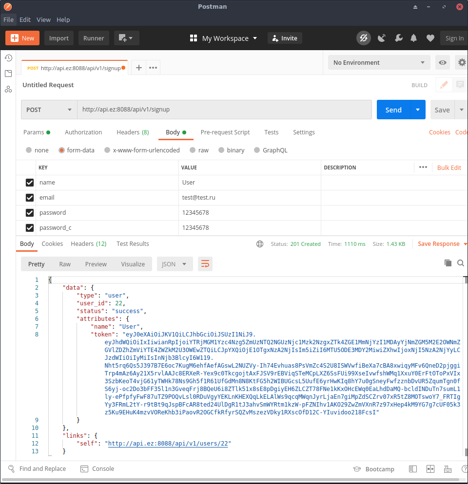
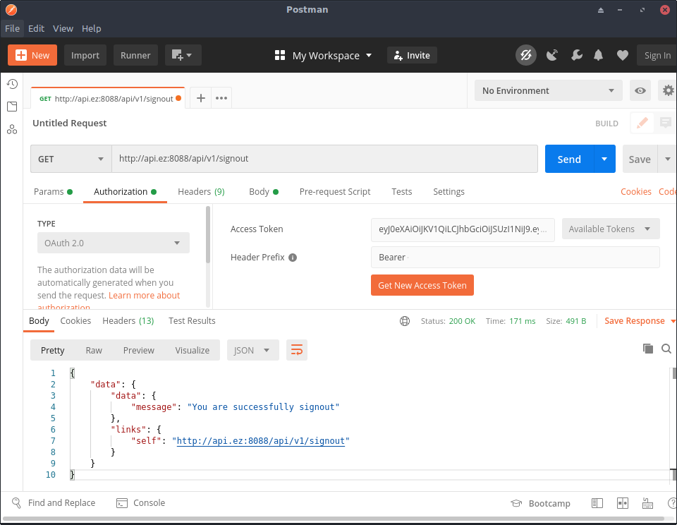
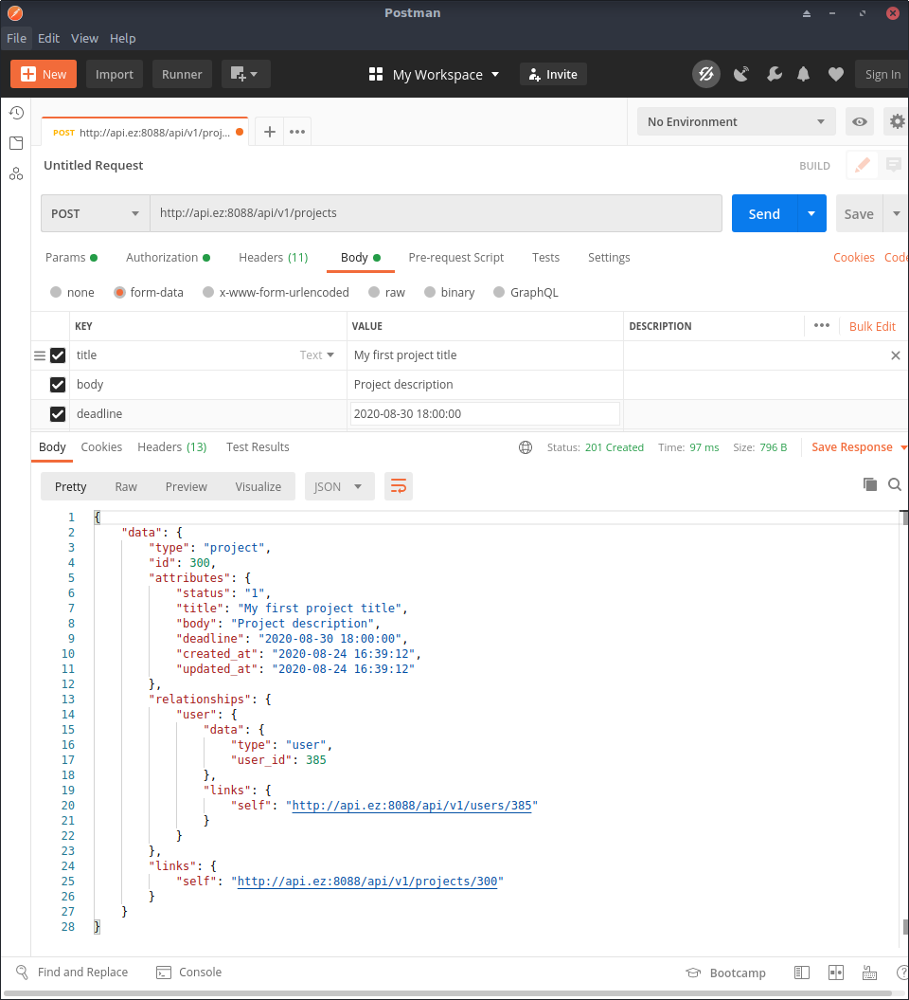
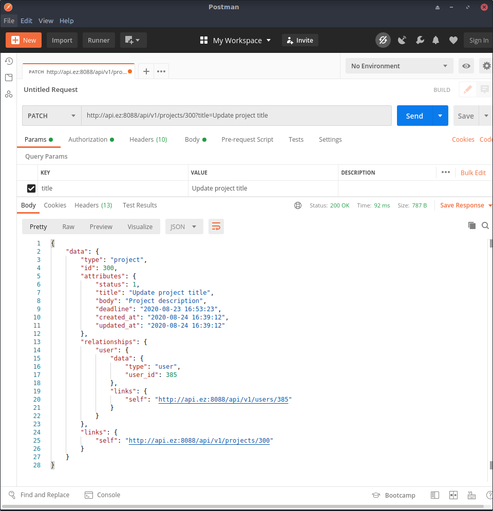
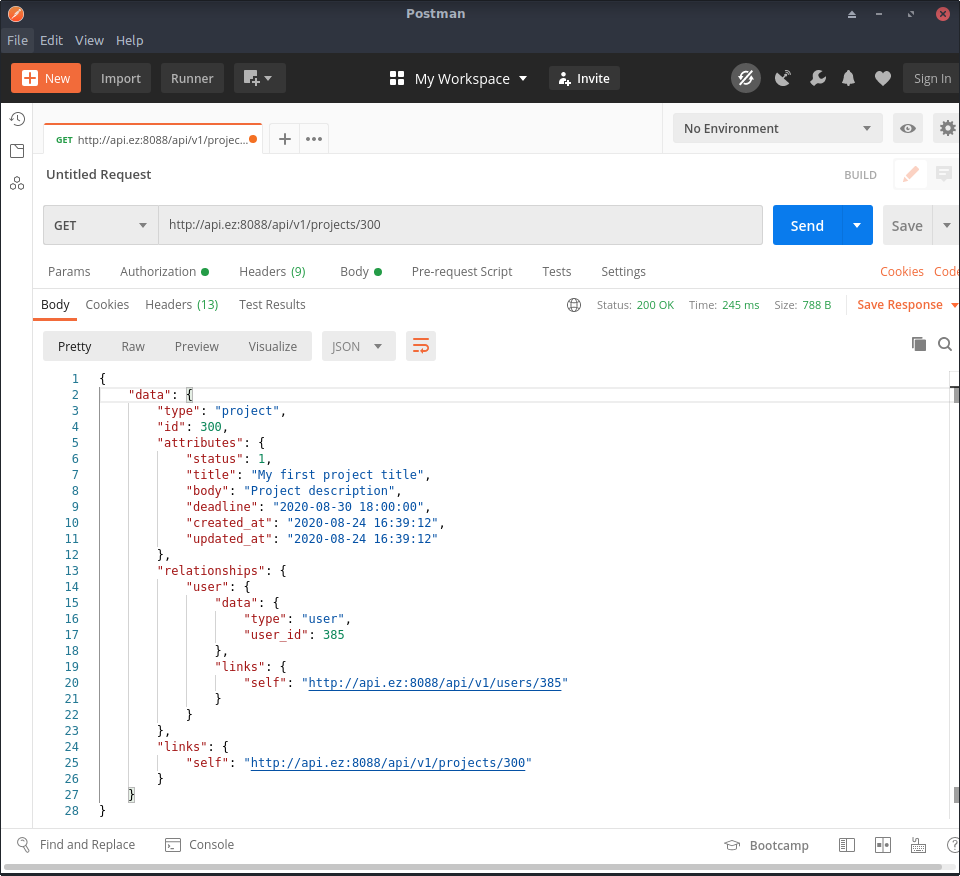
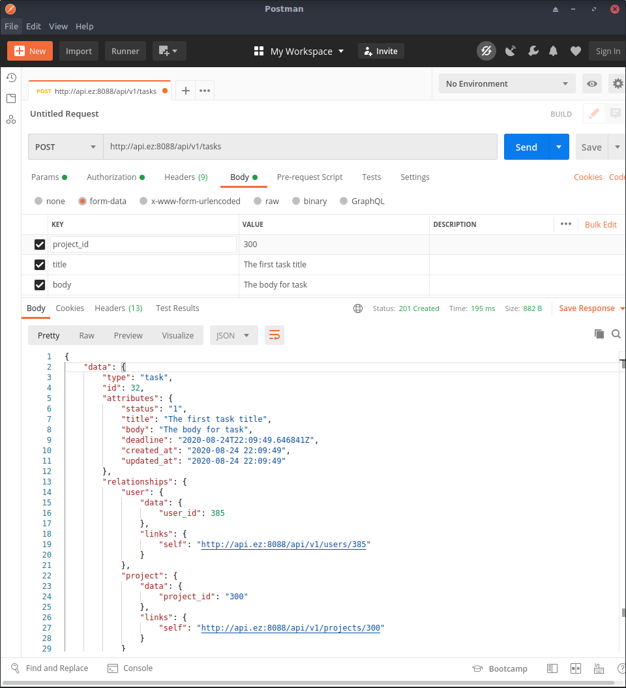
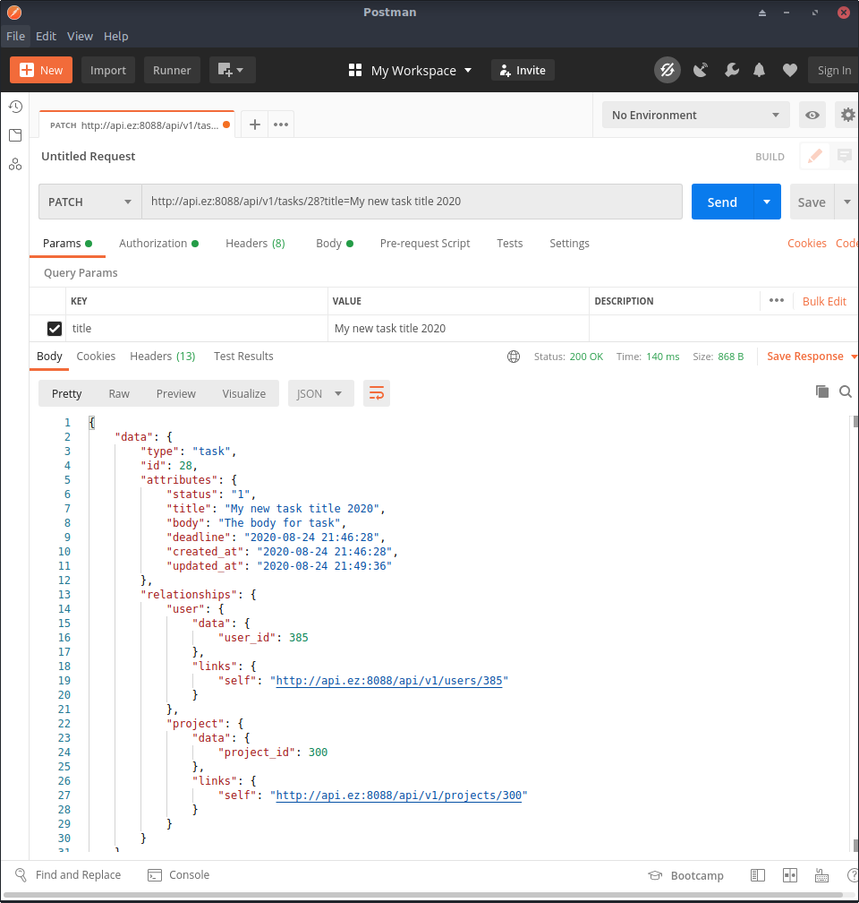
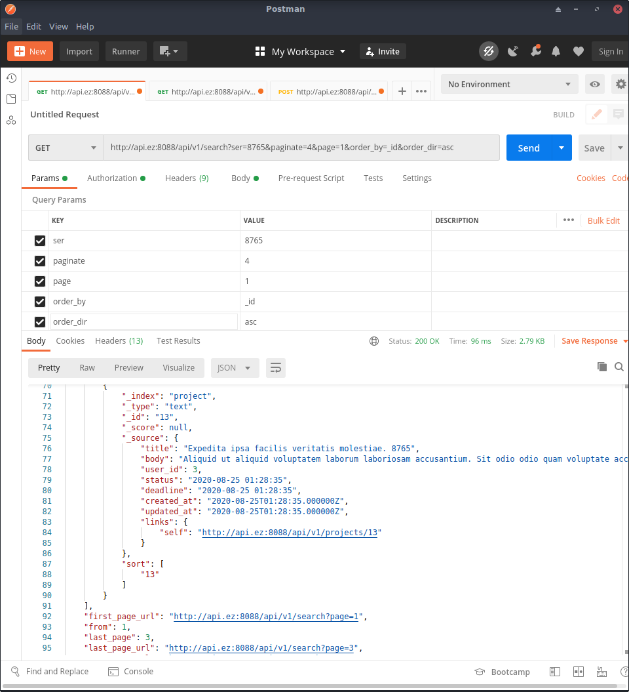

# Laravel Task Manager
## Техническое задание
**Описание задачи:**

Реализовать микросервисное приложение трекера задач с управлением задачами через JSON API. Можно использовать любой из современных фреймворков.

**Приложение должно содержать:**
1) Задачи
2) Список пользователей

**Возможные действия через API:**
1) Создание/удаление/редактирование задачи
2) Создание/удаление/редактирование пользователя
3) Поиск задач по фильтру с постраничной навигацией

**Технические требования**
- Приложение должно быть написано на PHP 7 или выше
- API должно быть написано по спецификации https://jsonapi.org/
- Весь код должен быть прокомментирован в стиле PHPDocumentor'a.
- Использовать любую реляционную БД (MySQL, PostgreSQL)
- Результат задания должен быть выложен на github и должна быть инструкция по запуску проекта. Также необходимо пояснить, сколько на каждую часть проекта ушло времени
- Никакого фронта не должно быть. Приложение должно работать только через JSON API.

**Плюсом будут:**
- Использование фреймворка Symfony или Laravel
- Соответствие стиля кода PSR-12
- Покрытие кода unit, функциональными и интеграционными тестами
- Работа с БД через миграции
- Использование ElasticSearch
- Использовать docker-compose для сборки приложения
## Оглавление

* [Планирование проекта](#plan)
* [Установка и настройка](#setup)
* [Тестирование](#test)
* [Работа с приложением](#work)
* [Пользователи ](#users) 
    * [Регистрация пользователя ](#signup) 
    * [Авторизация пользователя (получение токена) ](#usersignin)
    * [Получение информации о текущем пользователе ](#getuserinfo)
    * [Изменение информации о пользователе ](#patchuserinfo)
    * [Удаление пользователя](#deluserinfo)
    * [Выход из системы (смена токена) ](#sistemsignout)
* [Проекты ](#projetsshow)
    * [Добавление проекта (список задач) ](#addproject)
    * [Обновление проекта ](#updateproject)
    * [Удаление проекта ](#projectdel)
    * [Информация по проекту ](#projectinfo)
    * [Список проектов](#projectsall)
* [Задачи ](#tasks)
    * [Добавление задачи ](#addtask)
    * [Обновление задачи ](#updatetask)
    * [Удаление задачи ](#deltest)
    * [Информация по задаче ](#taskinfo)
    * [Список задач](#tasksall)
* [Фильтры ](#filters)
* [Поиск (Elasticserch) ](#search)
    * [Индексация документов ](#searchindex)
    * [Поиск с фильтрами ](#elserch)
    * [Удаление документов ](#killsearch)

## Планирование проекта <a id="plan"></a>
**Старт работы над проектом:** 23.08.2020

**Завершение работы над проектом:** 25.08.2020

**Затраченное время:** 1485 минут = 24,5 часа.
 
| № п./п. | Задачи  | Время выполнения (мин.)|
| ------------- | ------------- | ------------- |
| 1 | Планирование проекта (задачи проекта, структура таблиц)  | 30 |
| 2 | Подготовка рабочей среды (конфигурация apache, создание бд, создание проекта, настройка id)  | 25 |
| 3 | Создание репозитория, экспорт на github   | 5 |
| 4 | Создание миграций, фабрик, сидеров | 15 |
| 5 | Авторизация (регистрация пользователя, получение токена) | 240 |
| 6 | Списки задач (проекты) (создание, изменение, редактирование) | 300 |
| 7 | Задачи (создание, изменение, редактирование) | 60 |
| 8 | Отношения (пользователи, проекты, задачи) | 15 |
| 9 | Фильтры | 180 |
| 10 | Поиск и ElasticSearch (индексация/поиск/удаление) | 480 |
| 11 | Описание проекта в Readme | 120 |
| 12 | Рефакторинг от 30.08.2020 | 15 |
| 13 | **Итого** | **1485** |
 


## Установка и настройка <a id="setup"></a>

### 1. Клонируем репозиций
```sh
$ git clone https://github.com/evgeniizab/laravel.mytm.git
$ cd laravel.mytm
```

### Установка через docker
```bash
echo -e "$(cat .env.example)\n$(cat .env.docker)" >> .env \
&& docker-compose up --build -d
```

Add string host's file

```
127.0.0.1 laravel-mytm.loc
```
Migrate and Seeding

docker exec -it laravel-mytm_php bash
php artisan migrate --seed


Use
Docker commands start, stop, restart

docker-compose <command> && docker-compose logs -f

### Stop and remove containers, networks, images, and volumes
docker-compose down --rmi=all

PHPMYADMIN
laravel-mytm_mysql
dev
dev


http://0.0.0.0:8008

### 2. Настраиваем базу данных

Копируем .env.example в .env
```sh
$ cp .env.example .env
```
Редактируем .env
```sh
DB_CONNECTION=mysql
DB_HOST=XXXX
DB_PORT=3306
DB_DATABASE=XXXX
DB_USERNAME=XXXX
DB_PASSWORD=XXXX

ELASTICSEARCH_HOST=localhost
ELASTICSEARCH_PORT=9200
```
Создаем таблицы в БД
```sh
$ php artisan migrate
```
Генерируем ключ
```sh
$ php artisan key:generate
```
Подготавливаем passport
```sh
$ php artisan passport:install
```


## 3. Тестирование (23 теста) <a id="test"></a>
```
$ ./vendor/bin/phpunit 
```

## 4. Работа с приложением через Postman <a id="work"></a>
Для начала работы необходимо обнулить базу и выполнить следующие команды:
```
$ php artisan db:wipe
$ php artisan migrate --seed
$ php artisan passport:install
```

## Пользователи <a id="users"></a>
### Регистрация пользователя <a id="signup"></a>
| Параметры | 
| ------------- | 
| name |
| email | 
| password |
| password_c |
```
POST: /api/v1/signup
```
Тестирование:

```
TEST$ ./vendor/bin/phpunit --filter test_user_can_signup ./tests/Feature/UserTest.php
```
Полученный токен используем для авторизация:

| OAuth 2.0 |
| ------------- | 
| Access Token = токен |
| Header Prefix = Bearer |



Если ввели не существующий email:

```
{
    "data": {
        "errors": {
            "code": 422,
            "title": "The user can't be created",
            "detail": "The user with this email is already exists"
        }
    }
}
```
### Авторизация пользователя <a id="usersignin"></a>
| Параметры | 
| ------------- | 
| email | 
| password |
```
POST: /api/v1/signin
```
Тестирование:
```
TEST$ ./vendor/bin/phpunit --filter test_user_can_signin ./tests/Feature/UserTest.php
```


### Получение информации о текущем пользователе <a id="getuserinfo"></a>
```
GET: /api/v1/info/
```
Тестирование:
```
TEST$ ./vendor/bin/phpunit --filter test_user_can_get_info ./tests/Feature/UserTest.php
```
### Изменение информации пользователя <a id="patchuserinfo"></a>
| Параметры | 
| ------------- | 
| name | 
| email |
| password |
| password_c |
| old_password |
```
PATCH: /api/v1/users/{user_id}
```
Тестирование:
```
TEST$ ./vendor/bin/phpunit --filter test_user_can_update ./tests/Feature/UserTest.php
```


### Удаление пользователя <a id="deluserinfo"></a>
**Внимание:** удалить можно только в данный момент авторизованного пользователя.
```
DELETE: /api/v1/users/{user_id}
```
Тестирование:
```
TEST$ ./vendor/bin/phpunit --filter test_user_can_destroy ./tests/Feature/UserTest.php
```

### Выход из системы (смена токена) <a id="sistemsignout"></a>
```
GET: /api/v1/signout
```
Тестирование:
```
TEST$ ./vendor/bin/phpunit --filter test_user_can_signout ./tests/Feature/UserTest.php
```


Если не передали верный токен:

```
{
    "errors": {
        "code": 403,
        "title": "User not auth",
        "detail": "Route only for auth users"
    }
}
```
## Проекты <a id="projetsshow"></a>
| Параметры | Описание |
| ------------- | ------------- | 
| **title** | Название проекта. От 5 до 300 символов (обязательное поле)
| body |    Описание проекта. От 10 до 800 символов.
| deadline | Планируемая дата завершения проекта. Пример: 2020-08-24 16:39:12
| status | Статус проекта. Доступен только при изменении проекта. 1 - Проект создан, 2 - Проект выполняется, 3 - Проект остановлен, 4 - проект завершен

### Добавление проекта (список задач) <a id="addproject"></a>
```
POST: /api/v1/projects
```
Тестирование:
```
TEST$ ./vendor/bin/phpunit --filter test_user_can_add_project ./tests/Feature/ProjectTest.php
```



### Обновление проекта <a id="updateproject"></a>
```
PATCH: /api/v1/projects/{id}
```
Тестирование:
```
TEST$ ./vendor/bin/phpunit --filter test_user_can_update_project ./tests/Feature/ProjectTest.php
```



### Удаление проекта <a id="projectdel"></a>
```
DELETE: /api/v1/projects/{id}
```
Тестирование:
```
TEST$ ./vendor/bin/phpunit --filter test_user_can_destroy_project ./tests/Feature/ProjectTest.php
```

Если в проекте есть хоть одна задача, то его невозможно удалить

### Удаление проекта вместе с задачами <a id="projectkill"></a>
```
POST: /api/v1/projects/{id}/kill
```
Тестирование:
```
TEST$ ./vendor/bin/phpunit --filter test_user_can_destroy_project_with_tasks ./tests/Feature/ProjectTest.php
```
Сообщение при удалении проекта со всеми задачами
```
{
    "data": {
        "message": "Проект успешно удален вместо со всеми задачами!"
    },
    "links": {
        "self": "http://api.ez:8088/api/v1/projects"
    }
}
```

#### Информация по проекту <a id="projectinfo"></a>
```
GET: /api/v1/projects/{project_id}
```
Тестирование:

```
TEST$ ./vendor/bin/phpunit --filter test_user_can_view_project ./tests/Feature/ProjectTest.php
```



#### Информация по проектам <a id="projectsall"></a>
```
GET: /api/v1/projects
```
Тестирование:
```
TEST$ ./vendor/bin/phpunit --filter test_user_can_view_all_project ./tests/Feature/ProjectTest.php
``` 


### Задачи <a id="tasks"></a>
| Параметры | Описание |
| ------------- | ------------- | 
| **project_id** | Задачу можно создать только в рамках проекта (списка) (обязательное поле)
| **title** | Название проекта. От 5 до 300 символов (обязательное поле)
| body |    Описание проекта. От 10 до 800 символов.
| deadline | Планируемая дата завершения проекта. Пример: 2020-08-24 16:39:12
| status | Статус проекта. Доступен только при обновлении задачи. 1 - Проект создан, 2 - Проект выполняется, 3 - Проект остановлен, 4 - проект завершен

### Добавление задачи <a id="addtask"></a>
```
POST: /api/v1/tasks/{id}
```
Тестирование:
```
TEST$ ./vendor/bin/phpunit --filter test_user_can_add_task ./tests/Feature/TaskTest.php
```


### Обновление задачи <a id="updatetask"></a>
```
PATCH: /api/v1/tasks/{id}
```
Тестирование:
```
TEST$ ./vendor/bin/phpunit --filter test_user_can_update_task ./tests/Feature/TaskTest.php
```


### Удаление задачи <a id="deltest"></a>
```
DELETE: /api/v1/tasks/{id}
```
Тестирование:
```
TEST$ ./vendor/bin/phpunit --filter test_user_can_destroy_task ./tests/Feature/TaskTest.php
```
#### Информация по задаче <a id="taskinfo"></a>
```
GET: /api/v1/tasks/{task_id}
```
Тестирование:

```
TEST$ ./vendor/bin/phpunit --filter test_user_can_view_task ./tests/Feature/TaskTest.php
```

#### Информация по задачам <a id="tasksall"></a>
```
GET: /api/v1/tasks
```
Тестирование:
```
TEST$ ./vendor/bin/phpunit --filter test_user_can_view_all_tasks ./tests/Feature/TaskTest.php
``` 

## Фильтры <a id="filters"></a>
```
GET: /api/v1/users
GET: /api/v1/projects
GET: /api/v1/tasks
```
 Параметры | Описание |
| ------------- | ------------- | 
| id | 
| user_id | 
| title | 
| body | 
| status | 
| deadline | 
| created_at |   
| updated_at | 
| projects |
| tasks | 
| order_by |
| order_dir | asc, desc
| paginate | 

Тестирование:
```
TEST$ ./vendor/bin/phpunit --filter test_user_can_get_users_with_filters ./tests/Feature/UserTest.php
TEST$ ./vendor/bin/phpunit --filter test_user_can_projects_with_filters ./tests/Feature/ProjectTest.php
TEST$ ./vendor/bin/phpunit --filter test_user_can_tasks_with_filters ./tests/Feature/UserTest.php
```
Примeр:
```
http://api.ez:8088/api/v1/users?order_dir=desc&paginate=10&projects=1&tasks=1&id=1011
```

```
{
    "data": [
        {
            "data": {
                "type": "users",
                "id": 1011,
                "attributes": {
                    "name": "Jessy Walter",
                    "email": "ykonopelski@example.com",
                    "created_at": "2020-08-25 00:40:13",
                    "updated_at": "2020-08-25 00:40:13",
                    "projects": [
                        {
                            "data": {
                                "type": "project",
                                "id": 439,
                                "attributes": {
                                    "status": 1,
                                    "title": "Blanditiis rerum excepturi ea.",
                                    "body": "Et minima deleniti placeat vitae. Error alias blanditiis exercitationem placeat omnis quidem ut.",
                                    "deadline": "2020-08-25 00:40:13",
                                    "created_at": "2020-08-25 00:40:13",
                                    "updated_at": "2020-08-25 00:40:13"
                                },
                                "relationships": {
                                    "user": {
                                        "data": {
                                            "type": "user",
                                            "user_id": 1011
                                        },
                                        "links": {
                                            "self": "http://api.ez:8088/api/v1/users/1011"
                                        }
                                    }
                                },
                                "links": {
                                    "self": "http://api.ez:8088/api/v1/projects/439"
                                }
                            }
                        }
                    ],
                    "tasks": [
                        {
                            "data": {
                                "type": "task",
                                "id": 95,
                                "attributes": {
                                    "status": 1,
                                    "title": "Suscipit esse vel est mollitia.",
                                    "body": "Id alias repudiandae harum nesciunt aliquam nulla ut. Iste aliquam recusandae voluptatem quas omnis. Aliquam occaecati impedit dicta libero iste dolores.",
                                    "deadline": "2020-08-25 00:40:13",
                                    "created_at": "2020-08-25 00:40:13",
                                    "updated_at": "2020-08-25 00:40:13"
                                },
                                "relationships": {
                                    "user": {
                                        "data": {
                                            "user_id": 1011
                                        },
                                        "links": {
                                            "self": "http://api.ez:8088/api/v1/users/1011"
                                        }
                                    },
                                    "project": {
                                        "data": {
                                            "project_id": 439
                                        },
                                        "links": {
                                            "self": "http://api.ez:8088/api/v1/projects/439"
                                        }
                                    }
                                }
                            },
                            "links": {
                                "self": "http://api.ez:8088/api/v1/tasks/95"
                            }
                        }
                    ]
                }
            },
            "links": {
                "self": "http://api.ez:8088/api/v1/users/1011"
            }
        }
    ],
    "links": {
        "first": "http://api.ez:8088/api/v1/users?page=1",
        "last": "http://api.ez:8088/api/v1/users?page=1",
        "prev": null,
        "next": null
    },
    "meta": {
        "current_page": 1,
        "from": 1,
        "last_page": 1,
        "path": "http://api.ez:8088/api/v1/users",
        "per_page": "10",
        "to": 1,
        "total": 1
    }
}
```

## Поиск (Elasticserch) <a id="search"></a>
Для работы с Elasticserch необходимо настроить параметры в .env
```
ELASTICSEARCH_HOST=localhost
ELASTICSEARCH_PORT=9200
```

### Индексация документов <a id="searchindex"></a>
Индексация документов в Elasticsearch:
```
POST: /api/v1/search
```
Тестирование:
```
TEST$ ./vendor/bin/phpunit --filter test_user_can_set_es_index ./tests/Feature/ElasticTest.php
```

### Поиск с фильтрами <a id="elserch"></a>
Поиск с параметрами:
```
GET: /api/v1/search?ser=8765&paginate=4&page=1&order_by=_id&order_dir=asc
```
Тестирование:

```
TEST$ ./vendor/bin/phpunit --filter test_user_can_search_with_filters ./tests/Feature/ElasticTest.php
```


### Удаление документов <a id="killsearch"></a>
Удаление документов из Elasticsearch:
```
DELETE: /api/v1/search
```
Тестирование:
```
TEST$ ./vendor/bin/phpunit --filter test_user_can_delete_es_index ./tests/Feature/ElasticTest.php
```
